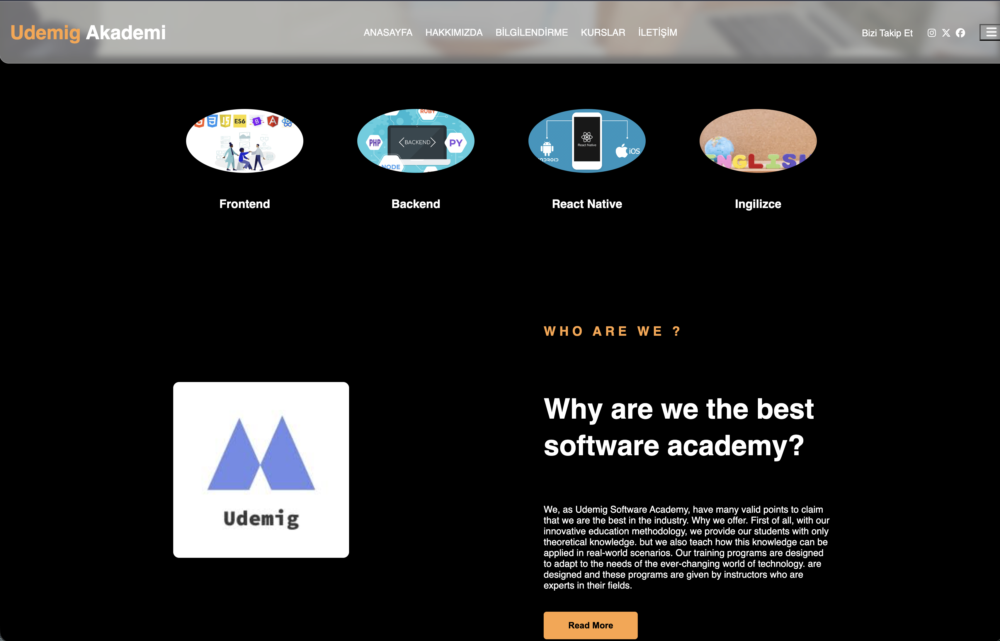
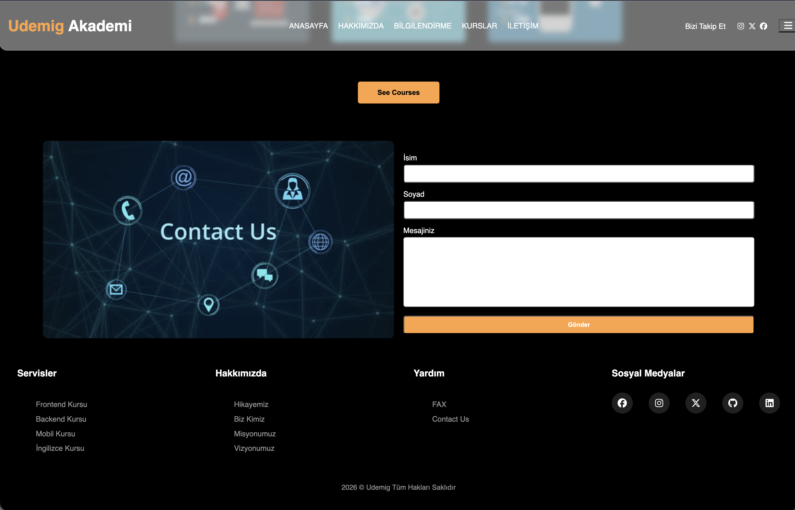

# udemig.pro-project 🚀

Modern ve sade bir arayüz çalışması.  
Bu proje HTML ve CSS kullanılarak geliştirilmiştir.

---

## 🎬 Demo Preview

> Arayüz akışı ve kullanıcı deneyimi bu önizlemede görülebilir.

---

## 🖼 Interface Screens

### 🧩 Screen 1

> Ana yapı ve içerik yerleşimi.

---

### 🎯 Screen 2

> Bölüm düzeni ve görsel hiyerarşi.

---

### 📱 Screen 3

> Responsive uyum ve tasarım dengesi.

---

## 🖥 Fullscreen View

> Sayfanın tam görünümü ve genel tasarım bütünlüğü.

---

## 🛠 Technologies

✨ HTML  
🎨 CSS  

- Semantic yapı
- Temiz kod organizasyonu
- Responsive tasarım

---

## 🙏 Teşekkür

Bu proje frontend gelişim sürecimin bir parçası olarak hazırlanmıştır.  
Sürece katkıları ve yönlendirmeleri için ** https://github.com/isveckrali **’a teşekkür ederim.

---

## 👤 Author

**Numan Balık**

🐙 GitHub: https://github.com/numanbalik-web  
💼 LinkedIn: https://www.linkedin.com/in/numan-balik-sverige  
📩 Email: numanbalik72@gmail.com

